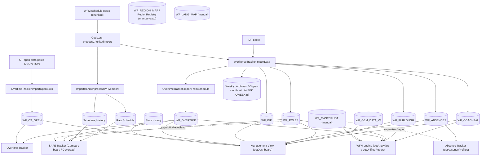

# MRC Operations Portal — Data Flow & Processing Contracts

> **Purpose.** Every tool (SAFE Tracker, Overtime Tracker, Management View, Absence
> Tracker, the WFM engine/Unified Report) reads from the **same imported sheets**, but each
> historically parsed dates/times/names, chose date windows, and de‑duplicated **differently**.
> That is the root cause of "data shows in one tool but not another." This file is the **single
> source of truth** for those contracts so changes stay consistent and divergences are visible.
> Keep it updated when you touch any tracker or the importer.

Timezone everywhere: **America/Toronto**. Week A/B anchor: **2026‑01‑29** (`_getCycleForEpoch`).

---

## 1. Import pipeline (who writes what)

**Order inside one schedule import** (`Code.gs:processChunkedImport`): `ImportHandler.processWFMImport`
(writes `Raw Schedule` + `Schedule_History`) → `WorkforceTracker.importData` (5 destructive upserts:
`WF_COACHING`, `WF_FURLOUGH`, `WF_ROLES`, `WF_ABSENCES`, `WF_IDP`) → `OvertimeTracker.importFromSchedule`
(`WF_OVERTIME`) → `archiveUnifiedReport` × (ALL/WEEK A/WEEK B) per affected month.

> ⚠️ **Crash‑safety:** the 5 destructive upserts (`WorkforceTracker._runDestructiveLogic`) and the
> archives do `clearContents()` **then** `setValues()`. If an import times out in that gap, the sheet
> is left **empty/partial** — this is why a soft‑crashed import can make the **Absence Tracker (or any
> tracker) "stop working"** until a clean re‑import. `Schedule_History`/`Raw Schedule` were converted
> to overwrite‑in‑place (SAFE20); the 5 `WF_*` upserts have **not** yet (planned).

---

## 2. Sheet schema (column index → meaning)

| Sheet | Cols (0‑indexed) | Written by |
|---|---|---|
| **Raw Schedule** / **Schedule_History** | 0 Agent, 1 ID, 2 DateStr `yyyy-MM-dd`, 3 Shift Start, 4 Shift End, 5 Shift Type, 6 Region, 7 Breaks JSON, 8 Role, 9 AbsentType, **10 StartEpoch (ms)**, **11 EndEpoch (ms)** | `ImportHandler.processWFMImport` / `archiveScheduleHistory` |
| **WF_COACHING / WF_FURLOUGH / WF_ROLES / WF_ABSENCES** | 0 Agent, 1 Date, 2 Activity/Role/Type, 3 Start, 4 End, 5 Region | `WorkforceTracker.importData` (`_executeDestructiveUpsert`) |
| **WF_IDP** | 0 Day, 1 Interval `HH:mm`, 2 Required, 3 Open | `WorkforceTracker.importData` |
| **WF_OVERTIME** | 0 Agent, 1 Date, 2 Code, 3 Rate, 4 Bucket, 5 IsBreak, 6 Start, 7 End, 8 Region | `OvertimeTracker.importFromSchedule` |
| **WF_OT_OPEN** | 0 Date, 1 Start, 2 End, 3 Slots, 4 Activity, 5 MinLen, 6 ADG, 7 ADValues, 8 Type, 9 Rate, 10 ReqGroup, 11 WindowHrs, 12 OpenHrs, 13 Visible(`N`=hidden), 14 OID | `OvertimeTracker.importOpenSlots` |
| **WF_MASTERLIST** | 0 Agent, 1 Level, 2 Supervisor, 3 Skills (`Name;#Lvl;#…`), 4 Location, 5 Email | manual |
| **WF_REGION_MAP** | 0 Key, 1 Display, 2 Region, 3 Source, 4 LastConfirmed | `RegionRegistry` |
| **WF_LANG_MAP** | 0 Key, 1 Display, 2 Lang(EN/FR/BL) | `SafeTracker.setAgentLang` |
| **Weekly_Archives_V3** | 0 Timestamp, 1 Cycle, 2 Period, 3 Agent, 4 Region, 5 TotalOffPhone, 6 JSON | `archiveUnifiedReport` |
| **Stats History** | 0 DateTime, 1 SVL%, 2 Ack | external/digest |
| **DB_Sessions** | 1 Agent, 2 Role, 3 Start, 4 End, 6 Hours | external |

---

## 3. Shared parsers — and where they disagree

| Helper (`WorkforceTracker.gs` unless noted) | Returns on bad input | Used by |
|---|---|---|
| `_formatDate` (`:1194`) | `""` | everyone (date col) — accepts Date, Excel serial >30000, ISO, M/D/Y |
| `_timeToMins` (`:1165`) | **`0`** (midnight!) | WFM engine, **OT Tracker**, Mgmt View, Absence Tracker, SAFE `getAnalytics` |
| `SafeTracker._safeTime` (`SafeTracker.gs:453`) | **`-1`** (reject) | SAFE board/range/roster — also parses fr‑CA `"13 h 30"` |
| `SafeTracker._shiftFromRow` (`:483`) | `null` | SAFE board/range/pin‑capable — **epoch cols 10/11 first**, text fallback |
| `_normalizeAgentKey` (`:15`) | `""` | token‑**sorted**, accent/comma‑safe key. Used by SAFE, Absence, Unified, RegionRegistry |
| `_getShiftSplits` (`:1144`) | — | Morning 07‑15 / Evening 15‑23 / Night 23‑07 |
| `_getCycleForEpoch` (`:585`) | — | Week A/B (anchor 2026‑01‑29) |
| `_calculateEpochBoundaries` (`:593`) | — | day/week/month/quarter/ytd window for the **trackers** |
| `ManagementView._periodBounds` (`:48`) | — | **separate** calendar window for Mgmt View (Sun–Sat weeks) |

**The big parser split:** `_timeToMins` returns **0** for anything it can't read (incl. fr‑CA date‑formatted
`"12/30/1899"` cells), so a tool using it silently gets midnight. `_shiftFromRow` reads the **epoch
columns** and is locale‑proof. SAFE uses the robust path; **OT/Mgmt/Absence/Unified still use the lenient
`_timeToMins` on text columns** → same row, different time.

---

## 4. Per‑tool processing contract

| Tool / entry | Source sheets | Date col → parser | Time parser | Name key | Date window | now‑cap? | Dedup key | Week A/B |
|---|---|---|---|---|---|---|---|---|
| **SAFE `getAnalytics`** (`SafeTracker.gs:67`) | WF_ROLES, WF_OVERTIME, WF_MASTERLIST | `[1]`→`_formatDate` | `_timeToMins` (text) | `_normalizeAgentKey` | `_calculateEpochBoundaries` | no | `src+agent+date+start+end` | yes |
| **SAFE board/range/pin** (`:615/746/544`) | Schedule_History, Raw Schedule (+activity fallback) | `[2]`→`_formatDate` | **`_shiftFromRow` (epoch‑first)** + `_safeTime` | `_normKey`+`_coreKey` | single date / ≤31‑day range | no | agent+date (history wins) | n/a |
| **OT `getAnalytics`** (`OvertimeTracker.gs:508`) | WF_OVERTIME, WF_OT_OPEN | `[1]`→`_formatDate` | **`_timeToMins` (text only — no epochs)** | **raw name (no normalize)** | `_calculateEpochBoundaries` | no | `agent+date+code+start+end` | yes |
| **Mgmt `getDashboard`** (`ManagementView.gs:136`) | WF_OVERTIME, WF_ROLES, WF_COACHING, WF_FURLOUGH, WF_ABSENCES, WF_IDP, WF_OT_OPEN, Stats History | `[1]`→`_dayStartEpoch`/`_formatDate` | `_timeToMins` via `_segInterval` | raw (no agent join) | `_periodBounds` (calendar) | **YES for actuals**; plan data (IDP, open OT, preCodedOT) uncapped | `agent+date+activity+start+end` | **no (calendar only)** |
| **Absence `getAbsenceProfiles`** (`WorkforceTracker.gs:396`) | WF_ABSENCES, WF_MASTERLIST | `[1]`→`_formatDate`, **then `dStr.startsWith(year)`** | `_timeToMins` | `_normalizeAgentKey` | **whole YEAR** (param) | yes (`dayMid<now`) | `agent+date+type+start+end`, then merge same‑day+type | no |
| **WFM engine `getAnalytics`/`getUnifiedReport`** (`:646/767`) | WF_COACHING/FURLOUGH/ROLES/OVERTIME, WF_MASTERLIST, DB_Sessions, WF_GEM_DATA_V3 | `[1]`→`_formatDate` | `_timeToMins` | `_normalizeAgentKey` (+ GEM fuzzy fallback) | bounds ±1d / month | **yes (`epoch<=now`)** | `agent+date+start+end+actSlice` | yes |

---

## 5. Known divergences → impact → fix (the roadmap)

| # | Divergence | Where | Impact | Fix direction |
|---|---|---|---|---|
| D1 | **OT/Mgmt/Absence/Unified parse times with `_timeToMins` (text)**, SAFE uses epoch‑first `_shiftFromRow` | §3 | fr‑CA `"12/30/1899"` cells → **0/midnight** in every non‑SAFE tool (wrong OT/absence/role hours) | Route all time reads through one epoch‑first helper (promote `_shiftFromRow`/`_safeTime` into shared use, or have `_timeToMins` consult epochs) |
| D2 | **OT analytics uses raw agent names**; others normalize | §4 | "First Last" vs "Last, First" splits/merges OT differently than SAFE/Mgmt | Normalize with `_normalizeAgentKey` in OT analytics + import |
| D3 | **`_timeToMins` returns 0 on failure** (not −1) | `:1175` | silent midnight instead of a visible error | Return −1 + callers guard (SAFE already does via `_safeTime`) |
| D4 | **Different windows/caps**: trackers use `_calculateEpochBoundaries` (no cap), Mgmt caps actuals at `now`, Unified caps `epoch<=now` | §4 | same metric differs across tools; future pre‑coded OT shows in OT Tracker, hidden in Mgmt/Unified | One documented rule per metric class: *actuals=to‑date, plan/forecast=full period* (Mgmt `preCodedOt` is the pattern to copy) |
| D5 | **Destructive upserts clear‑then‑write** | `_runDestructiveLogic:580` | a soft‑crashed import empties a tracker's sheet | Overwrite‑in‑place + clear tail (already done for Schedule_History/Raw; apply to the 5 `WF_*`) |
| D6 | **Dedup keys differ** (SAFE has `src`, OT lacks it) | §4 | re‑imports can double‑count in one tool, not another | Standardize an idempotent `agent|date|type|start|end` key |
| D7 | **Absence count semantics differ**: Mgmt = agent‑day (priority real>late>approved); Absence Tracker = merge same‑day+type | §4 | UNAB counts can differ between Mgmt and Absence Tracker | Pick one canonical "1 absence = 1 agent‑day‑type" rule and share it |
| D8 | **Region resolution order differs** per tool | §4 | an agent can be Onshore in one view, Offshore in another | Make `RegionRegistry` the single authority everywhere (it mostly is — enforce consistently) |

---

## 6. Diagnosis: "Absence Tracker empty, but WFM engine has 2026‑01‑01→06‑14"

`getAbsenceProfiles(year)` reads **only `WF_ABSENCES`** and filters with `dStr.startsWith(year)`
(`WorkforceTracker.gs:435`). It returns `{year, profiles:[]}` with **no error** when there's nothing to show.
The UI passes `state.trackerDate.substring(0,4)` (`JavaScript.html:672`), i.e. the year of the selected
date — for a 2026 selection that is `"2026"`, which **matches the 2026 data**. So the year filter is NOT
the cause here. The cause is:

1. **`WF_ABSENCES` was emptied by the timed‑out import** (clear‑then‑write gap, D5). → *Check the tab; if it's
   header‑only, re‑import (now faster post‑SAFE20) repopulates it.* **← confirmed most likely**
2. Year‑param mismatch — only if you manually view a different year than the data. (Ruled out for the
   reported 2026 case.)

Less likely: a name‑key typo (D2) hides an agent, or a region/registry override (D8) reclassifies them.

---

## 7. Rule of thumb when adding/editing a tool
- Read times via the **epoch‑first** path; never trust text time columns alone (D1/D3).
- Key agents with **`_normalizeAgentKey`** (D2).
- Decide explicitly: is this metric an **actual** (cap at today) or **plan/forecast** (full period)? (D4)
- Never `clearContents()` before you have the new rows ready — overwrite in place (D5).
- Resolve region only through **RegionRegistry** (D8).
