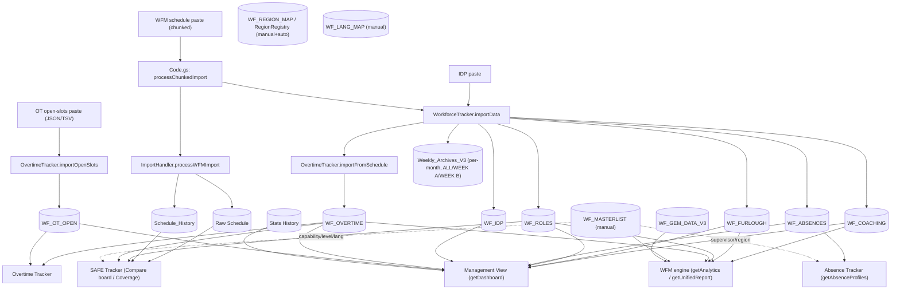

# MRC Operations Portal — Data Flow & Processing Contracts

> **Purpose.** Every tool (SAFE Tracker, Overtime Tracker, Management View, Absence
> Tracker, the WFM engine/Unified Report) reads from the **same imported sheets**, but each
> historically parsed dates/times/names, chose date windows, and de‑duplicated **differently**.
> That is the root cause of "data shows in one tool but not another." This file is the **single
> source of truth** for those contracts so changes stay consistent and divergences are visible.
> Keep it updated when you touch any tracker or the importer.

Timezone everywhere: **America/Toronto**. Week A/B anchor: **2026‑01‑29** (`_getCycleForEpoch`).

---

## 1. Import pipeline (who writes what)

**Report pastes (Management View feeds).** Two IEX/BI exports are pasted into the
same Import box and auto-detected (`JavaScript.html: runImportAction`), then parsed by
`CORE/ReportImport.gs`:
- **Activity loading hours** (`Exception Grp`/`Activity Name`/week-of-Sunday cols) →
  `WF_ACTIVITY_WK` [WeekStart(Sun), ExceptionGrp, Code, ActivityName, Hours]. The
  Management View overlays these authoritative weekly hours onto the IEX Coding card
  (`getActivityCodes`) and renders an "Activity Loading" group card.
- **Alarms by service type** (`Alarm Vol.`/`AHT Secs` by month) → `WF_ALARMS`
  [Month, PrioRank, PrioGrp, Desc, ServId, Vol, AHT]; rendered as an "Alarms by Service
  Type" card (`getAlarms`, months overlapping the selected period).
- **Forecast vs actuals** (`Fcst Alarm`/`Fcst Acc`; daily "Day of Ref Date" or monthly
  "Month of Ref Date") → `WF_FORECAST` [Grain, Period, FcstAcc, FcstAlarm, AlarmVol,
  InSvlVol, FcstAht, ActAht, Svl, Pct{High,Med,Low,MAS,MIX,Operator}]. Grain-scoped
  replace (day & month coexist). Rendered as the "Volume vs Forecast" card
  (`getForecast`: daily rows for day/week views, monthly for month/quarter/ytd).
  Detected BEFORE alarms (it also carries "AHT Secs" but has no service-type column).

**Order inside one schedule import** (`Code.gs:processChunkedImport`): `ImportHandler.processWFMImport`
(writes `Raw Schedule` + `Schedule_History`) → `WorkforceTracker.importData` (5 destructive upserts:
`WF_COACHING`, `WF_FURLOUGH`, `WF_ROLES`, `WF_ABSENCES`, `WF_IDP`) → `OvertimeTracker.importFromSchedule`
(`WF_OVERTIME`) → `archiveUnifiedReport` × (ALL/WEEK A/WEEK B) per affected month.

> **Both import paths archive (SAFE29).** The direct/small path `importWorkforceData` now also runs
> `ImportHandler.run(sched)` in the same call. Previously it relied on a separate fire‑and‑forget
> `runImport` call that could silently fail — which is how `WF_ROLES` (SAFE hours) could exist with no
> `Schedule_History` row ("SAFE hours but no shift" in Coverage).

> ✅ **Crash‑safety (FIXED, SAFE21):** `Schedule_History`, `Raw Schedule`, and the 5 destructive upserts
> (`WorkforceTracker._runDestructiveLogic`) now **overwrite in place + clear the tail** instead of
> `clearContents()`‑then‑`setValues()`. A timed‑out import can no longer leave a tracker's sheet empty.
> All time columns are also written as **plain text** so Sheets cannot coerce `"9:00 AM"` into a date
> serial (`12/30/1899`).

---

## 2. Sheet schema (column index → meaning)

| Sheet | Cols (0‑indexed) | Written by |
|---|---|---|
| **Raw Schedule** / **Schedule_History** | 0 Agent, 1 ID, 2 DateStr `yyyy-MM-dd`, 3 Shift Start, 4 Shift End, 5 Shift Type, 6 Region, 7 Breaks JSON, 8 Role, 9 AbsentType, **10 StartEpoch (ms)**, **11 EndEpoch (ms)** | `ImportHandler.processWFMImport` / `archiveScheduleHistory` |
| **WF_COACHING / WF_FURLOUGH / WF_ROLES / WF_ABSENCES** | 0 Agent, 1 Date, 2 Activity/Role/Type, 3 Start, 4 End, 5 Region | `WorkforceTracker.importData` (`_executeDestructiveUpsert`) |
| **WF_IDP** | 0 Day, 1 Interval `HH:mm`, 2 Required, 3 Open | `WorkforceTracker.importData` |
| **WF_OVERTIME** | 0 Agent, 1 Date, 2 Code, 3 Rate, 4 Bucket, 5 IsBreak, 6 Start, 7 End, 8 Region | `OvertimeTracker.importFromSchedule` |
| **WF_OT_OPEN** | 0 Date, 1 Start, 2 End, 3 Slots, 4 Activity, 5 MinLen, 6 ADG, 7 ADValues, 8 Type, 9 Rate, 10 ReqGroup, 11 WindowHrs, 12 OpenHrs, 13 Visible(`N`=hidden), 14 OID | `OvertimeTracker.importOpenSlots` |
| **WF_MASTERLIST** | 0 Agent, 1 Level, 2 Supervisor, 3 Skills (`Name;#Lvl;#…`), 4 Location, 5 Email | manual |
| **WF_REGION_MAP** | 0 Key, 1 Display, 2 Region, 3 Source, 4 LastConfirmed | `RegionRegistry` |
| **WF_LANG_MAP** | 0 Key, 1 Display, 2 Lang(EN/FR/BL) | `SafeTracker.setAgentLang` |
| **Weekly_Archives_V3** | 0 Timestamp, 1 Cycle, 2 Period, 3 Agent, 4 Region, 5 TotalOffPhone, 6 JSON | `archiveUnifiedReport` |
| **Stats History** | 0 DateTime, 1 SVL%, 2 Ack | external/digest |
| **DB_Sessions** | 1 Agent, 2 Role, 3 Start, 4 End, 6 Hours | external |

---

## 3. Shared parsers — and where they disagree

| Helper (`WorkforceTracker.gs` unless noted) | Returns on bad input | Used by |
|---|---|---|
| `_formatDate` (`:1194`) | `""` | everyone (date col) — accepts Date, Excel serial >30000, ISO, M/D/Y |
| `_timeToMins` (`:1165`) | **`0`** (midnight!) | WFM engine, **OT Tracker**, Mgmt View, Absence Tracker, SAFE `getAnalytics` |
| `SafeTracker._safeTime` (`SafeTracker.gs:453`) | **`-1`** (reject) | SAFE board/range/roster — also parses fr‑CA `"13 h 30"` |
| `SafeTracker._shiftFromRow` (`:483`) | `null` | SAFE board/range/pin‑capable — **epoch cols 10/11 first**, text fallback |
| `_normalizeAgentKey` (`:15`) | `""` | token‑**sorted**, accent/comma‑safe key. Used by SAFE, Absence, Unified, RegionRegistry |
| `_getShiftSplits` (`:1144`) | — | Morning 07‑15 / Evening 15‑23 / Night 23‑07 |
| `_getCycleForEpoch` (`:585`) | — | Week A/B (anchor 2026‑01‑29) |
| `_calculateEpochBoundaries` (`:593`) | — | day/week/month/quarter/ytd window for the **trackers** |
| `ManagementView._periodBounds` (`:48`) | — | **separate** calendar window for Mgmt View (Sun–Sat weeks) |

**The big parser split (NARROWED, SAFE21):** `_timeToMins` now parses fr‑CA `"13 h 30"`, meridian‑anywhere
(`"9:00:00 p.m."`→21:00), and day‑fractions, and rejects date serials — matching `_safeTime` except it
still returns **0** (not −1) on truly empty/unparseable input to preserve its callers' contract. So
OT/Mgmt/Absence/Unified now read fr‑CA times correctly. Only a fully date‑formatted cell (`"12/30/1899"`,
time wholly stripped) is unrecoverable from text — and the importer now writes time columns as **plain
text** so that coercion no longer happens. `_shiftFromRow` (epoch‑first) remains the most robust and is
used by the SAFE board where the epoch columns exist.

---

## 4. Per‑tool processing contract

| Tool / entry | Source sheets | Date col → parser | Time parser | Name key | Date window | now‑cap? | Dedup key | Week A/B |
|---|---|---|---|---|---|---|---|---|
| **SAFE `getAnalytics`** (`SafeTracker.gs:67`) | WF_ROLES, WF_OVERTIME, WF_MASTERLIST | `[1]`→`_formatDate` | `_timeToMins` (text) | `_normalizeAgentKey` | `_calculateEpochBoundaries` | no | `src+agent+date+start+end` | yes |
| **SAFE board/range/pin** (`:615/746/544`) | Schedule_History, Raw Schedule (+activity fallback) | `[2]`→`_formatDate` | **`_shiftFromRow` (epoch‑first)** + `_safeTime` | `_normKey`+`_coreKey` | single date / ≤31‑day range | no | agent+date (history wins) | n/a |
| **OT `getAnalytics`** (`OvertimeTracker.gs:508`) | WF_OVERTIME, WF_OT_OPEN | `[1]`→`_formatDate` | **`_timeToMins` (text only — no epochs)** | **raw name (no normalize)** | `_calculateEpochBoundaries` | no | `agent+date+code+start+end` | yes |
| **Mgmt `getDashboard`** (`ManagementView.gs:136`) | WF_OVERTIME, WF_ROLES, WF_COACHING, WF_FURLOUGH, WF_ABSENCES, WF_IDP, WF_OT_OPEN, Stats History | `[1]`→`_dayStartEpoch`/`_formatDate` | `_timeToMins` via `_segInterval` | raw (no agent join) | `_periodBounds` (calendar) | **YES for actuals**; plan data (IDP, open OT, preCodedOT) uncapped | `agent+date+activity+start+end` | **no (calendar only)** |

> **Mgmt View extras (this build).** `getDashboard` also emits real-absence **hours** (`totals.*.absHours/absHoursOff`) and a Night/Morning/Evening **shift split** (`absShift`, via `WorkforceTracker._getShiftSplits`) on both the period totals and each `absSeries[]` bucket; the client shows absence hours, "% of the Sun–Sat week" (`absHours ÷ schedH`), a concentration-by-shift doughnut, and an SL-vs-absence-by-shift chart. A coded-hours **total** beside its breakdown sums `ot + acsu(VFurlough) + reading + elearn + tower`; `elearn` is a WF_ROLES role match (`ELEARN/E-LEARN/VILT/VIRTUAL`), **0 until a feed exists**. It also emits `totals.sel.codes` — per-IEX-code period hours for the **IEX Coding Compiled & Misc** card (ACSU from WF_FURLOUGH; CE-HUDDLE/QUAL/ONE/SBYS/MEET from WF_COACHING activity strings via `_coachCode`; READ/WOFQT/VILT from WF_ROLES; OT from WF_OVERTIME). Codes not captured at import (LFQI/CLASSROOM/AUTH/SME/E-Learning) render as **"pending feed"** until the schedule importer is extended to store them. The `lunch` (stacking concurrency) and `abs` (per-type onshore/offshore mix) payloads are unchanged but now render in the **Furlough / Absence trackers** (fed by a `getManagementDashboard('week', ref)` call), not in the Mgmt View.
| **Absence `getAbsenceProfiles`** (`WorkforceTracker.gs:396`) | WF_ABSENCES, WF_MASTERLIST | `[1]`→`_formatDate`, **then `dStr.startsWith(year)`** | `_timeToMins` | `_normalizeAgentKey` | **whole YEAR** (param) | yes (`dayMid<now`) | `agent+date+type+start+end`, then merge same‑day+type | no |
| **WFM engine `getAnalytics`/`getUnifiedReport`** (`:646/767`) | WF_COACHING/FURLOUGH/ROLES/OVERTIME, WF_MASTERLIST, DB_Sessions, WF_GEM_DATA_V3 | `[1]`→`_formatDate` | `_timeToMins` | `_normalizeAgentKey` (+ GEM fuzzy fallback) | bounds ±1d / month | **yes (`epoch<=now`)** | `agent+date+start+end+actSlice` | yes |

---

## 5. Known divergences → impact → fix (the roadmap)

| # | Status | Divergence | Impact | Resolution |
|---|---|---|---|---|
| D1 | ✅ **FIXED (SAFE21)** | non‑SAFE tools parsed times with lenient `_timeToMins` | fr‑CA `"9 h 00"`/`"9:00:00 p.m."` → 0/midnight everywhere | `_timeToMins` upgraded to parse fr‑CA + meridian‑anywhere + reject serials; importer writes time cols as plain text so no coercion |
| D3 | ✅ **FIXED (SAFE21)** | `_timeToMins` mis‑read serials/odd formats | silent wrong times | serials/junk now → 0 explicitly; valid fr‑CA/meridian formats parse correctly; empty stays 0 (contract kept) |
| D5 | ✅ **FIXED (SAFE21)** | destructive upserts clear‑then‑write | a soft‑crashed import emptied a tracker's sheet | `_runDestructiveLogic` + `Schedule_History`/`Raw Schedule` now overwrite‑in‑place + clear tail (covered by tests N & archive) |
| D4 | ✅ **Handled** | actuals vs plan caps | future pre‑coded OT hidden in Mgmt | rule documented; Mgmt `preCodedOt` implements it (SAFE19). Apply same pattern if new forecast metrics are added |
| D2 | ⏸️ **Held (low‑risk)** | OT analytics uses raw names | only matters if OT is cross‑joined by name | OT is single‑source (names come from one paste, already consistent). Normalize **only** when adding a cross‑tool name join — doing it now would change displayed groupings with no observed bug |
| D6 | ⏸️ **Held (would change counts)** | dedup keys differ per tool | re‑imports could double‑count | each tool's key is internally consistent today; unifying risks shifting reported totals — change only with a migration + re‑archive |
| D7 | ⏸️ **Held (would change counts)** | Mgmt agent‑day vs Absence merge‑same‑day | UNAB counts can differ slightly | both already collapse a shift to ~1 per agent‑day‑type; forcing identical math could move published absence numbers — align deliberately, not blind |
| D8 | ✅ **Mostly enforced** | region resolution order | rare onshore/offshore disagreement | `RegionRegistry` is authoritative on import + in SAFE/Absence/Unified; Mgmt reads the stored region column (written from the same registry at import) |

> **Why D2/D6/D7 are intentionally held:** they don't fix a reported failure and they *change numbers*.
> "Foolproof" means not silently shifting your published OT/absence totals without a deliberate
> migration. Say the word on any one and I'll do it with a re‑archive + before/after diff.

---

## 6. Diagnosis: "Absence Tracker empty, but WFM engine has 2026‑01‑01→06‑14"

`getAbsenceProfiles(year)` reads **only `WF_ABSENCES`** and filters with `dStr.startsWith(year)`
(`WorkforceTracker.gs:435`). It returns `{year, profiles:[]}` with **no error** when there's nothing to show.
The UI passes `state.trackerDate.substring(0,4)` (`JavaScript.html:672`), i.e. the year of the selected
date — for a 2026 selection that is `"2026"`, which **matches the 2026 data**. So the year filter is NOT
the cause here. The cause is:

1. **`WF_ABSENCES` was emptied by the timed‑out import** (clear‑then‑write gap, D5). → *Check the tab; if it's
   header‑only, re‑import (now faster post‑SAFE20) repopulates it.* **← confirmed most likely**
2. Year‑param mismatch — only if you manually view a different year than the data. (Ruled out for the
   reported 2026 case.)

Less likely: a name‑key typo (D2) hides an agent, or a region/registry override (D8) reclassifies them.

---

## 7. Rule of thumb when adding/editing a tool
- Read times via the **epoch‑first** path; never trust text time columns alone (D1/D3).
- Key agents with **`_normalizeAgentKey`** (D2).
- Decide explicitly: is this metric an **actual** (cap at today) or **plan/forecast** (full period)? (D4)
- Never `clearContents()` before you have the new rows ready — overwrite in place (D5).
- Resolve region only through **RegionRegistry** (D8).
